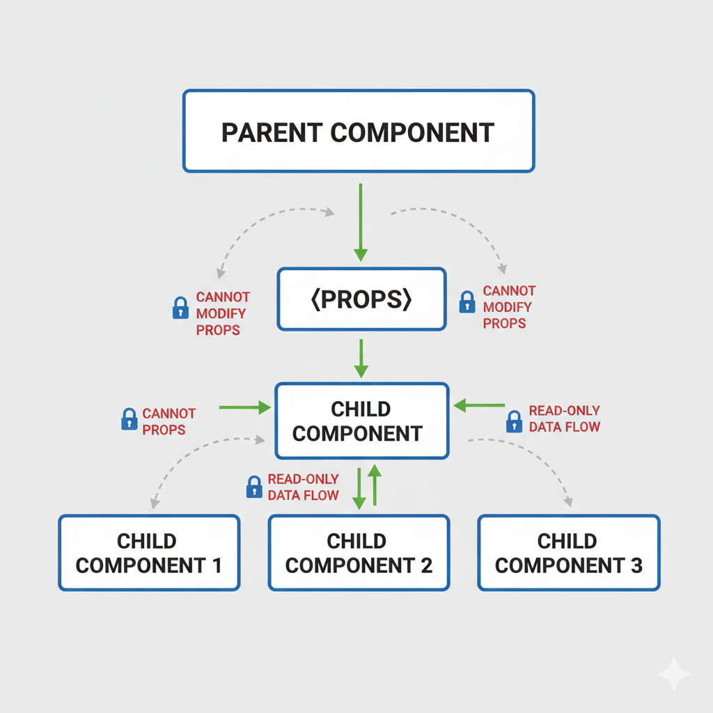

# Passing Props to a Component

## props

컴포넌트 간에 서로 정보를 주고 받을 때, props를 사용한다.

특히 리액트에서 props는 부모 컴포넌트가 자식 컴포넌트에 데이터를 전달할 때 사용하는 속성

```jsx
function Avatar() {
  return (
    
  );
}
```

JSX에서 HTML 태그를 사용할 때, `className, src, alt, width, height` 등 정해진 속성만 사용할 수 있다.

반면에 React 컴포넌트를 만든다면 props를 자유롭게 정의하고 부모 컴포넌트가 원하는 값을 전달할 수 있다.

## props 전달, 읽기

### 전달

부모 컴포넌트가 자식 컴포넌트를 JSX에서 호출할 때 props를 인자로 전달하고, 전달되는 값들은 자바스크립트 객체 형태로 전달된다.

```jsx
export default function Profile() {
  return (
    <Avatar person={{ name: "Lin Lanying", imageId: "1bX5QH6" }} size={100} />
  );
}
```

### 읽기

```jsx
function Avatar(props) {
  // React 컴포넌트는 매개변수로 props 객체 하나만을 받음
  console.log(props.person);
  console.log(props.size);
}

// 구조 분해 할당으로 바로 선언
function Avatar({ person, size }) {
  console.log(person);
  console.log(size);
}
```

#### prop의 default 값을 설정

```jsx
function Avatar({ person, size = 100 }) {
  // ...
}
```

falsy값 중에 null 또는 0 일 때는 기본값으로 지정 안된다. 조금 유추를 해보자면 undefined 와 null의 차이를 자바스크립트에서 배웠었는데 null이나 0같은 경우에는 undefined와 달리 거의 개발자가 의도적으로 지정해주기 때문에 default값을 적용하지 않는 것이 아닐까 싶다.

그래서 가끔 타입을 이용해서 개발을 할 때, 의도치 않게 null일 때는 데이터를 보호하지 못하기 때문에 default값을 설정하지 않고 `nulish ??`를 사용했던 적이 있다.

#### spread

```jsx
function Profile(props) {
  return (
    <div className="card">
      <Avatar {...props} />
    </div>
  );
}
```

스프레드 문법을 이용해서 props를 한번에 모두 전달할 수 있다.

하지만 스프레드 문법을 남용하는 것보다 필요한 데이터만 직접 넘기고, children을 사용해서 좀 더 유연하게 구조를 짜는게 더 좋다.

```jsx
interface ButtonProps
  extends Omit<ButtonHTMLAttributes<HTMLButtonElement>, "className"> {
  children: ReactNode;
  variant: Variant;
  size: Size;
  danger?: boolean;
  className?: string;
}

const BaseButton = ({
  children,
  variant = "solid",
  size = "large",
  className,
  danger,
  ...rest // 어떤 props가 들어올지 예측이 어렵다
}: ButtonProps) => {
  return (
    <button
      {...rest}
      type="button"
      className={cn(
        BASE_BUTTON_BASE_STYLE,
        BASE_BUTTON_STYLE_BY_SIZE[size],
        BASE_BUTTON_STYLE_BY_VARIANT[variant],
        variant.includes("outlined") &&
          size === "medium" &&
          "bg-background-inverse",
        danger && BASE_BUTTON_DANGER_STYLE,
        className
      )}
    >
      {children}
    </button>
  );
};
```

### props의 불변성

props는 불변 객체로 다루어져야 한다.

React에서는 props와 state의 변경을 감지하여 리렌더링을 수행하는데, 이때 불변성을 통해서 변경 여부를 판단한다.

즉, props 객체를 직접 수정하지 않고 새로운 객체로 교체하는 방식으로 변경을 처리해야 한다.

> fiber가 이를 감지하여 Render -> 재조정(이전 prop과 현재 prop 비교, 메모이제이션도 체크) -> commit -> update 과정을 거친다

# Conditional Rendering

## if문을 사용하여 조건부 렌더링

```jsx
function Item({ name, isPacked }) {
  if (isPacked) {
    return <li className="item">{name} ✅</li>;
  }
  return <li className="item">{name}</li>;
}

// null 반환
function Item({ name, isPacked }) {
  if (isPacked) {
    return null;
  }
  return <li className="item">{name}</li>;
}
```

실제로 if문을 사용해서 조건부 렌더링을 할 때, 에러나 로딩처리, 또는 null을 반환하는 경우가 종종 있다.

```jsx
function Modal({ isOpen }) {
  if (!isOpen) {
    return null;
  }
  return ...
}
```

## 삼항 연산자

```jsx
function Item({ name, isPacked }) {
  if (isPacked) {
    return <li className="item">{name} ✅</li>;
  }
  return <li className="item">{name}</li>;
}
```

현재 코드 같은 경우에는 중복되는 부분도 있고 만약 className을 바꿔야 한다면 두 군데 모두 수정 해야하기 때문에 이럴 때는 삼항 연산자를 이용하는게 더 나을 수 있다.

```jsx
function Item({ name, isPacked }) {
  return <li className="item">{isPacked ? name + " ✅" : name}</li>;
}
```

## && 연산자

```jsx
function Item({ name, isPacked }) {
  return (
    <li className="item">
      {name} {isPacked && "✅"}
    </li>
  );
}
```

## let 변수 활용

```jsx
function Item({ name, isPacked }) {
  let itemContent = name;
  if (isPacked) {
    itemContent = name + " ✅";
  }
  return <li className="item">{itemContent}</li>;
}
```

비슷하게 지난 1주차 내용에 있었던 중괄호안에서 함수 호출도 방법이 될 수도 있겠다.

> [week-01 중괄호 사용](https://github.com/FE18-Survivor/react-docs-study/blob/main/week-01/%EC%83%81%EC%9D%B8.md#%EC%A4%91%EA%B4%84%ED%98%B8-%EC%82%AC%EC%9A%A9)

```jsx
function Item({ name, isPacked }) {
  const getItemContent = (name, isPacked) => {
    if (isPacked) {
      return name + " ✅";
    }

    return name;
  };
  return <li className="item">{getItemContent(name, isPacked)}</li>;
}
```

## 조금 더

## props는 단방향 전달(부모 -> 자식)



# Rendering Lists

## map 배열 렌더링

배열의 값들을 map 메서드를 사용해서 렌더링 할 수 있다.

```jsx
function Component() {
  const listItems = people.map((person) => <li>{person}</li>);
  return <ul>{listItems}</ul>;
}

function Component() {
  return (
    <ul>
      {people.map((person) => (
        <li>{person}</li>
      ))}
    </ul>
  );
}
```

## filter 후 렌더링

```jsx
function Component() {
  const chemists = people.filter((person) => person.profession === "chemist");
  const listItems = chemists.map((person) => (
    <li>
      
      <p>
        <b>{person.name}:</b>
        {" " + person.profession + " "}
        known for {person.accomplishment}
      </p>
    </li>
  ));

  return <ul>{listItems}</ul>;
}
```

## key

리스트를 렌더링할 때 key값을 지정해주지 않으면 콘솔에 다음 에러가 뜬다.

`Each child in a list should have a unique "key" prop.`

리스트를 렌더링할 때는 각 요소에 반드시 고유한 key 값을 지정해야 한다.

React는 전체 DOM을 매번 다시 그리지 않고, 변경이 필요한 부분만 효율적으로 업데이트하기 위해 key 값을 기준으로 요소를 비교하기 떄문이다.

그렇지 않는다면, 만약에, 배열의 index를 key로 사용할 경우 데이터가 변경되면 요소의 위치가 바뀌면서 index도 함께 변한다. 이때 React는 이전과 동일한 요소를 새 요소로 잘못 인식할 수 있어, 예상치 못한 렌더링 문제가 발생할 수 있다.

## 정리

이 챔터에서 중요한 것은 React에서 key를 사용하는 목적은 바로 React가 리스트 항목을 정확하게 추적할 수 있도록 도와주는 식별자 역할이고, 고유한 key를 부여해서 조정자가 효율적으로 DOM을 업데이트 하자는 것을 전달하고 싶은 것 같다.

# Keeping Components Pure

## 컴포넌트는 순수하게 작성

순수 함수는 입력이 같으면 항상 같은 출력을 내고, 외부 상태를 변경하지 않는다.

React는 컴포넌트가 순수 함수라고 가정을 하는데, **React 컴포넌트도 항상 같은 `props, state context`가 들어오면 항상 같은 JSX를 반환해야 한다.**

## 순수하지 않은 컴포넌트 얘시

```jsx
let guest = 0;

function Cup() {
  guest = guest + 1;
  return <h2>Tea cup for guest #{guest}</h2>;
}

export default function TeaSet() {
  return (
    <>
      <Cup />
      <Cup />
      <Cup />
    </>
  );
}
```

Cup 이라는 컴포넌트를 다시 호출 했을 때, 결과 예측이 어렵다 (다른 결과가 나올 수 있다).

## React에서 순수함수로 가정하는 이유

- 컴포넌트는 서버에서도 동작을 할 수 있다. 같은 결과를 반환하기 떄문에 컴포넌트 하나가 여러 요청을 처리할 수 있다. (SSR에서의 예시?)
- 순수 함수는 동일한 결과를 반환하기에 캐싱에 좋다.

## side effect

side effect는 순수 함수처럼 예상대로 결과가 나오는 것이 아니라, 외부의 영향을 받는 것을 의미하고, 예상치 못한 결과를 발생시킬 수 있다.

React의 컴포넌트 내에서 DOM을 직접 조작하거나, 전역 변수를 수정하는 것들이 side effect에 해당한다.

대신, React는 이러한 것들을 이벤트 핸들러나 useEffect 훅과 같이 처리하도록 권장한다.

## 정리

` React는 변경이 필요한 작업들을 이벤트 핸들러나 useEffect 훅과 같이 처리하도록 권장한다.` 라고 했는데, 사실 렌더링으로 잘 구조를 짜고, 다음으로 이벤트 핸들러, useEffect는 최후의 보루로 사용해라고 권장을 하는 것 같다. 또, 순수성을 지키면서 컴포넌트를 만들기만 하면(근데 사실 이게 어렵고 실력) React의 장점을 이미 자연스럽게 극대화 하고 있는 것이다.

## 나는 요즘 useEffect로 AI 코드인지 구분을 한다.

리액트의 순수성과는 조금 다르고 제어냐 비제어냐에 더 가깝긴 하지만, useEffect 부분에서 갑자기 생각이 났고, 그리고 UI의 불일치 관점에서 비슷한 것 같아서 예시 코드를 가져왔다.

useEffect는 정말 만능 hook이라고 생각한다. 오히려 그래서 임시방편으로 AI가 해결책으로 제안해주는 경우가 많은 것 같다. 특히 최근에 여러 프로젝트를 해보면서 공통 컴포넌트를 개발할 때마다 억지 useEffect를 많이 보는 것 같아서 나도 useEffect를 적절할 때 쓰고있나? 계속 체크를 하는 것 같다.

`부모의 상태를 자식에서 복사해서 별도로 관리하는 경우`

```jsx
function Task({ done }) {
  const [isDone, setIsDone] = useState(done);

  useEffect(() => {
    setIsDone(done);
  }, [done]);

  return (
    <div>
      <input
        type="checkbox"
        checked={isDone}
        onChange={(e) => setIsDone(e.target.checked)} //
      />
      <span>{isDone ? "완료" : "진행 중"}</span>
    </div>
  );
}
```

인풋의 값(done)이 사용자가 바꾸려면 내부 state가 필요하다고 착각하기 쉽다라고 이해를 하려고 하고 있다. 여기서 UI가 원하는대로 제어가 안되니까 임시방편으로 AI는 아무것도 모르고 useEffect를 추가해주는 문제

```jsx
function Task({ done, setDone }) {
  return (
    <div>
      <input
        type="checkbox"
        checked={done}
        onChange={(e) => setDone(e.target.checked)}
      />
      <span>{done ? "완료" : "진행 중"}</span>
    </div>
  );
}
```

# Understanding Your UI as a Tree

## 렌더 트리(Render Tree)

React에서 컴포넌트는 부모-자식 관계를 가지고, 이 각 컴포넌트가 하나의 노드이다. 이 컴포넌트들, 즉 노드들로 구성된 UI트리를 렌더 트리라고 한다.

여기서 Root 노드는 최상위 컴포넌트이고, React가 처음으로 렌더링하고, 자식 노드들을 렌더링한다.

리프(Leaf) 컴포넌트는 최하위 컴포넌트이며 자식이 없는 노드를 뜻한다.

## 모듈 의존성 트리

파일들의 import 관계(파일 연결 구조?)를 트리로 나타낸 것이다.

아무래도 렌더 트리와는 다르게 js 파일간의 트리이기 때문에 컴포넌트가 아니더라도 트리에 나타날 수 있다.

이 의존성 트리에 속한 js 파일들을 번들러가 빌드시에 실행에 필요한 코드만 포함한다.

## 조금 더

기존에 이해하고 있던 지식은 VDOM이 브라우저와는 별개로 변화를 감지하고, 이를 렌더 트리가 렌더링 한다 정도로만, 조금 추상적으로 알고 있었던 것 같다.

1. React는 JSX로부터 Virtual DOM 트리를 만든다.
2. Virtual DOM에 조정자가 어어떤 부분이 변경되었는지 계산하여 반영한다.
3. 변경된 부분을 브라우저 DOM에 그린다.
4. 브라우저는 DOM을 기반으로 렌더 트리를 구성한다.
5. 렌더 트리를 이용해 레이아웃, 프린트한다.

그런데, 조금 혼동이 왔던 점은 이 챕터에서 말하는 렌더트리는 기존에 배웠던 브라우저의 렌더링 과정의 렌더트리를 설명하는 것이 아닌 것 같았다.

조금 더 찾아보니 React Render Tree와 Browser Render Tree를 구분짓는 게 맞는 것 같고, 해당 챕터에서 설명하는 렌더트리는 React Render Tree에 가깝고, 기존에 알고 있던 Fiber의 개념들이 사실 여기서 설명하는 React Render Tree를 포함한다고 정리했다. 검색을 좀 더 해봤는데 Fiber Tree라고도 부르는 것 같다.
