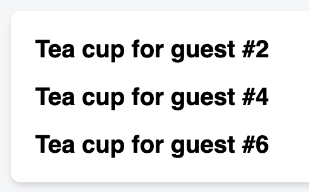
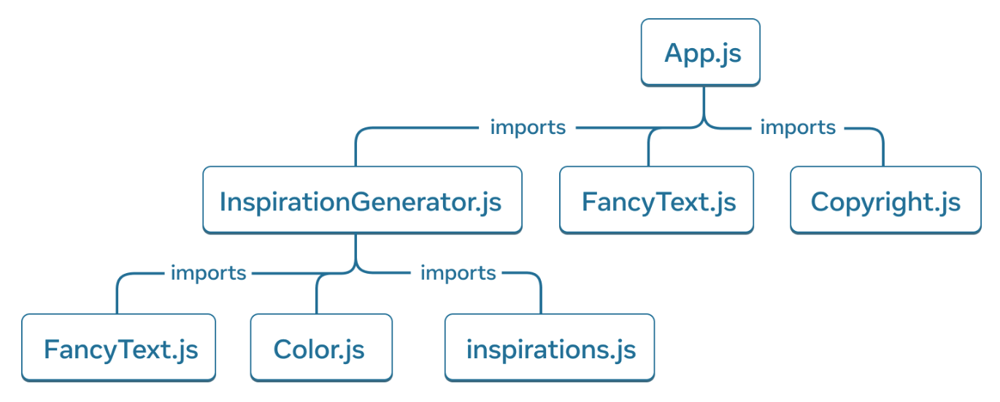

# Week 02

## [Passing Props to a Component](https://react.dev/learn/passing-props-to-a-component)

- Parent component는 props를 통해 child component에 데이터 전달 가능
- HTML attributes와 달리 JSX로 만들어진 component는 JavaScript 객체, 배열, 함수 등을 전달할 수 있음

### Familiar props

```javascript

```

- Props는 JSX tag에 전달하는 정보 (e.g. `` component에 `className`, `src`, `alt`, `width`, `height` 등 전달)
- React가 제공하는 `` 등 기본 tag들에 전달할 수 있는 prop은 ReactDOM에 미리 정의되어 있음 (HTML standard를 준수하는 props)

### Passing props to a component

```javascript
import { getImageUrl } from "./utils.js";

function Avatar({ person, size }) {
  return (
    
  );
}

export default function Profile() {
  return (
    <Avatar
      size={100}
      person={{
        name: "Katsuko Saruhashi",
        imageId: "YfeOqp2",
      }}
    />
  );
}
```

- Custom component에 전달하는 props는 component 함수의 argument로 전달
- Props는 객체로 모아서 전달되므로, **destructuring 문법**을 사용해서 prop 값에 접근 가능

  ```javascript
  function Avatar(props) {
    const person = props.person;
    const size = props.size;
    // ...
  }

  // equals to

  function Avatar({ person, size }) {
    // ...
  }
  ```

- Props를 사용하면 parent와 child components를 독립적으로 생각할 수 있음
  - `Profile`은 `Avatar`가 props를 사용하는 방법을 고려하지 않고 `person`, `size` prop의 값을 변경할 수 있음
  - `Avatar`는 `Profile`이 `Avatar`를 어떻게 사용하는지 고려하지 않고 `person`, `size` prop을 사용한 로직을 변경할 수 있음

### Specifying a default value for a prop

```javascript
function Avatar({ person, size = 100 }) {
  // ...
}

export default function Profile() {
  return (
    <Avatar
      person={{
        name: "Katsuko Saruhashi",
        imageId: "YfeOqp2",
      }}
    />
  );
}
```

- JavaScript destructuring 문법과 동일하게 prop에 `=`로 기본값 설정
- 기본값이 설정된 prop은 값이 전달되지 않을 때에만 사용됨
- 위 코드에서 `Profile`이 `Avatar`에 `size` prop 값을 전달하지 않았으므로, `Avatar` 내부에서 `size`는 기본값(`100`)을 사용

### Forwarding props with the JSX spread syntax

- 같은 이름의 props를 child component에 그대로 전달하는(forwarding props) 경우 코드가 불필요하게 반복됨
  ```javascript
  function Profile({ person, size, isSepia, thickBorder }) {
    return (
      <div className="card">
        <Avatar
          person={person}
          size={size}
          isSepia={isSepia}
          thickBorder={thickBorder}
        />
      </div>
    );
  }
  ```
- JavaScript의 spread syntax를 활용해서 props를 child component로 전달하는 코드를 간결하게(concise) 작성 가능
  ```javascript
  function Profile(props) {
    return (
      <div className="card">
        <Avatar {...props} />
      </div>
    );
  }
  ```
- **단, Spread syntax는 제한적으로 사용해야 한다.**

### Passing JSX as children

```javascript
import Avatar from "./Avatar.js";

function Card({ children }) {
  return <div className="card">{children}</div>;
}

export default function Profile() {
  return (
    <Card>
      <Avatar
        size={100}
        person={{
          name: "Katsuko Saruhashi",
          imageId: "YfeOqp2",
        }}
      />
    </Card>
  );
}
```

- JSX tag에 중첩된 component는 `children` prop으로 전달된다.
- `children` prop을 활용해서 component를 더 유연하게 만들 수 있다. -> `children`에 어떤 component가 들어올 지 신경쓰지 않아도 됨
- `children` prop은 panels, grids 등 visual wrapper에서 사용할 수 있다.

### How props change over time

- Props는 시간이 지남에 따라 바뀔 수 있는 데이터이다.
- 즉, props는 component가 초기화될 때가 아닌 특정 시점에 component가 갖는 data를 나타낸다.
- 하지만 props는 immutable 이므로, **props가 변경되어야 한다면 parent component에 다른 props를 전달해 달라고 요청해야 한다.**
- **Props를 직접 변경하려고 하면 안 된다. 대신, `setState` 같은 state를 사용한다.**

## [Conditional Rendering](https://react.dev/learn/conditional-rendering)

- Component를 특정 조건(condition)에 따라 다르게 보여줘야 할 때가 있다.
- JavaScript의 `if`문, `&&`, `? :` 연산자 등을 사용해서 component를 조건부로 렌더링(conditionally render) 할 수 있다.

### Conditionally returning JSX

- `if`/`else` statement로 조건에 따라 다른 JSX를 반환한다.
  ```javascript
  function Item({ name, isPacked }) {
    if (isPacked) {
      return <li className="item">{name} ✅</li>;
    }
    return <li className="item">{name}</li>;
  }
  ```
  - 조건에 따라 반환되는 두 JSX는 동일(equal)하다.
  - JSX는 실제 DOM node가 아닌 lightweight description 이므로, 각각이 다른 instance가 아님
- 이 때, `null`을 반환하면 아무것도 렌더링하지 않는다.
  ```javascript
  function Item({ name, isPacked }) {
    if (isPacked) {
      return null;
    }
    return <li className="item">{name}</li>;
  }
  ```

### Conditionally including JSX

- JSX 내부 요소를 조건부로 포함시킴으로써, 다른 종류의 JSX를 조건부로 반환할 때 중복되는 코드를 제거할 수 있음
- `? :` operator 사용 (`condition ? <A /> : <B />`)
  ```javascript
  function Item({ name, isPacked }) {
    return <li className="item">{isPacked ? name + " ✅" : name}</li>;
  }
  ```
- `&&` operator 사용 (`condition && <A />`)
  ```javascript
  return (
    <li className="item">
      {name} {isPacked && "✅"}
    </li>
  );
  ```
  - 조건에 따라 렌더링하지 않는 case가 있을 때 활용 가능
  - `? :` operator를 사용할 때 장황해 지는 코드를 단순하게 만들 수 있다.
  - 이 때, **`&&` operator 왼쪽에 숫자를 넣지 않는다.**
    - `&&` 연산자는 왼쪽 피연산자가 truthy 일 때 오른쪽 피연산자를 반환
    - 왼쪽 피연산자가 `0`이면 falsy 값이므로 왼쪽 피연산자를 반환할 것
    - 이 때, React는 `0`을 값으로 인식하여 `0`을 렌더링 하므로 '아무것도 렌더링하지 않을' 상황에 사용할 수 없음
    - 비교 연산자를 사용해서 `boolean` 값으로 반환되게 만들어야 한다.
      - `messageCount` 변수의 값이 0보다 클 때만 렌더링하기
      - `messageCount > 0 && <p>New messages</p>`
- JSX를 변수로 사용
  - 조건에 따라 달라지는 값을 변수에 저장한 뒤 curly braces(`{}`)를 사용해서 JSX에 삽입
    ```javascript
    let itemContent = name;
    if (isPacked) {
      itemContent = name + " ✅";
    }
    return <li className="item">{itemContent}</li>;
    ```
  - 조건식에 JSX를 직접 사용하지 않으므로 확장성이 높다.

---

## [Rendering Lists](https://react.dev/learn/rendering-lists)

> **Summary**
>
> - Array items를 `map()` 등 method를 통해 component로 변환하는 경우 `key`를 사용해서 어떤 data가 어떤 component에 matching 되는지 React에게 알려줘야 한다.
> - React는 이전 render와 동일한 `key`를 가진 component를 재사용하여 성능을 향상시킬 수 있다.
> - Key는 data 자체의 ID, key 등 고유하게 식별 가능한 값을 사용해야 한다.

- Data만 다른 동일한 component들을 보여줘야 하는 경우, JavaScript array의 `filter()`, `map()` 등 method를 사용해서 data array를 component로 변환할 수 있다.
  ```javascript
  const people = [
    "Creola Katherine Johnson: mathematician",
    "Mario José Molina-Pasquel Henríquez: chemist",
    "Mohammad Abdus Salam: physicist",
    "Percy Lavon Julian: chemist",
    "Subrahmanyan Chandrasekhar: astrophysicist",
  ];
  export default function List() {
    const listItems = people.map((person) => <li>{person}</li>);
    return <ul>{listItems}</ul>;
  }
  ```
- 이 때, **`map()` 등 array method 내부에서 반환되는 JSX는 반드시 `key` prop을 가져야 함**
  - Key는 React에 array item과 component matching 시켜 주는 역할
  - Array item이 변경되면(이동, 수정, 삭제 등) React는 key 값을 사용해서 DOM을 정확하게 update 할 수 있음
- Key 규칙
  - Key는 array 안에서 unique 해야 한다.
    - Database에서 data에 부여된 key, ID 등
    - `crypto.randomUUID()` 또는 `uuid` package를 사용해서 직접 생성한 값
  - Key는 rendering 중에 생성 및 변경되면 안 된다.
- 여러 개의 component들을 fragment(`<></>`)로 묶는 경우, `key` prop을 사용할 수 없으므로 명시적으로 `<Fragment>`를 사용
  ```javascript
  import { Fragment } from "react";
  // ...
  const listItems = people.map((person) => (
    <Fragment key={person.id}>
      <h1>{person.name}</h1>
      <p>{person.bio}</p>
    </Fragment>
  ));
  ```

### Why does React need keys?

- Item을 고유하게 식별하기 위해 key를 사용
- Key를 잘 정의하면 array에서 순서가 바뀌어도 React가 `key`를 사용해서 **array item에 해당하는 component를 식별할 수 있다.**
- Array index 등 위치(position)는 key로 사용하기 적절하지 않음
  - `key`를 설정하지 않으면 React가 내부적으로 index를 사용할 것
  - Array가 순서가 바뀌거나 특정 item이 삭제되는 등 변경되는 경우 문제가 생길 수 있음
  - `Math.random()` 등 랜덤 값을 runtime에 생성하는 것도 마찬가지
  - Rendering 전/후에 key가 매칭되지 않아서 component가 re-rendering 될 때마다 새로 생성됨

## [Keeping Components Pure](https://react.dev/learn/keeping-components-pure)

> **Summary**
>
> - React component는 순수 함수여야 한다.
>   - Pure component는 caching을 통해 최적화 할 수 있다.
>   - Pure component는 이전 render 결과에 영향을 받지 않아 빠르게 re-rendering 할 수 있다.
> - Side effect는 event handler 또는 `useEffect` 안에서만 실행되어야 한다.
> - Local mutation은 component의 순수성에 영향을 주지 않는다. 즉, component 내부에서 선언한 변수는 제약없이 변경할 수 있다.

### Purity

- Pure function(순수 함수)
  - **It minds its own busines** : 함수가 호출되기 이전에 존재하던 object나 변수를 변경하지 않는 함수
  - **Same inputs, same output** : 동일한 input을 넣으면 항상 동일한 output을 얻는 함수
    ```javascript
    function double(number) {
      return 2 * number;
    }
    ```
- Component를 엄격하게 순수 함수로 작성하면 codebase가 커지면서 예상치 못한 문제와 버그를 예방할 수 있다.
- React는 모든 component를 순수 함수로 취급. 즉, **React component는 동일한 input에 대해 항상 동일한 JSX를 반환해야 한다.**

### Side effects

- 아래 component는 rendering 되기 이전에 존재하던 변수(`guest`)를 변경하므로 순수 함수가 아님
  ```javascript
  let guest = 0;
  function Cup() {
    // Bad: changing a preexisting variable!
    guest = guest + 1;
    return <h2>Tea cup for guest #{guest}</h2>;
  }
  ```
- `<Cup />`을 rendering 할 때마다 반환되는 JSX 결과물이 달라짐
  ```javascript
  export default function TeaSet() {
    return (
      <>
        <Cup />
        <Cup />
        <Cup />
      </>
    );
  }
  ```
  
- `guest`를 prop으로 받도록 수정해서 순수 함수로 만들 수 있음
  ```javascript
  function Cup({ guest }) {
    return <h2>Tea cup for guest #{guest}</h2>;
  }
  ```
  - Input(`guest`)이 동일하면 항상 같은 JSX륿 반환하므로 순수 함수
- `StrictMode`를 사용해서 비순수 연산(impure calculations)을 탐지할 수 있음
  - **React의 strict mode를 사용하면 component 함수가 두 번씩 호출됨**
  - App root component를 `<StrictMode>`로 감싸서 strict mode 활성화
  - Component 함수가 순수하지 않다면, component 함수를 두 번 호출했을 때 rendering 되는 결과가 한 번 호출했을 떄와 다를 것
  - Component 함수가 순수하다면, 두 번 호출되어도 결과가 변하지 않을 것
  - `StrictMode`는 개발 중에만 동작하므로 production에서 사용자에게 영향을 주지 않음

### Local mutation

- 순수 함수는 함수 scope 외부에서 이전부터 존재하던 object나 변수를 변경(mutate)하지 않음
- 함수 내부에서 rendering 중에 생성한 object나 변수는 변경해도 괜찮다.
  ```javascript
  function Cup({ guest }) {
    return <h2>Tea cup for guest #{guest}</h2>;
  }
  export default function TeaGathering() {
    const cups = [];
    for (let i = 1; i <= 12; i++) {
      cups.push(<Cup key={i} guest={i} />);
    }
    return cups;
  }
  ```
  - `cups` 변수는 `TeaGathering` component 내부에서만 생성되고 사용되므로 변경해도 안전
  - 이런 종류의 'local mutation'은 side effect가 아님

### Where you can cause side effects

- 함수형 프로그래밍은 순수성(purity)에 강하게 의존하지만, 그래도 무언가 바뀌기는 해야 함
- 이런 변경사항을 'side effects'라고 한다.
  - "side" : rendering 이외 시점(on the side)
- 일반적으로 React에서 side effect는 event handler에서 처리된다.
  - Rendering 동안에 호출되지 않음
  - Rendering이 끝난 뒤 event가 발생한 시점에만 호출됨
  - 즉, **event handler는 순수하지 않아도 됨**
- 이외의 시점에 side effect를 호출하려면 `useEffect`를 사용
  - React에게 rendering이 끝난 뒤에 실행할 작업을 알려주는 역할
  - Rendering이 종료된 후 실행되므로 side effect가 허용됨
  - 단, **이 방법은 최후의 수단이어야 함**

### Why does React care about purity?

- Component가 순수 함수로 작성되면 다른 환경(e.g. server)에서 실행될 때 하나의 component로 여러 요청을 처리할 수 있음
- Component의 input이 변경되지 않았다면 rendering을 생략해서 성능을 향상시킬 수 있음
  - Input이 같으면 output도 항상 동일하므로 caching 할 수 있음
- Component tree를 rendering하는 동안 data가 변경되면, React는 outdated render가 종료되길 기다리지 않고 rendering을 즉시 다시 시작할 수 있음
  - 이전 rendering을 아무 때나 중단시키고 새로운 data로 rendering을 즉시 재시작 해도 안전함
  - 순수 함수이므로 재시작한 rendering이 중단된 이전 rendering 결과에 영향을 받지 않음

## [Your UI as a Tree](https://react.dev/learn/understanding-your-ui-as-a-tree)

> **Summary**
>
> - React는 render tree로 component들 간 관계를 modeling하고 관리한다.
> - React는 module dependency tree로 bundling 해야 하는 JavaScript module을 결정한다.
> - React는 다양한 platform에 UI를 rendering 하는 library 이므로, render tree에는 platform specific UI가 포함되지 않는다.
>   - Render tree에는 web platform에서만 사용되는 HTML tag가 포함되지 않는다.
> - Render tree를 통해 top-level 및 leaf components를 식별하고 성능 최적화에 활용할 수 있다.
>   - Top-level component는 많은 child components를 포함하므로 자주 rendering 하지 않는 것이 좋다.
>   - Leaf component는 child component를 갖지 않으므로 자주 rendering 되어도 된다.

- React를 비롯한 많은 UI library들이 UI를 **tree 구조**로 관리함

### UI as a tree

- Tree는 item 사이의 관계(relationship)를 modeling
- UI도 tree 구조로 표현할 수 있음 (e.g. DOM, CSSOM)
- 마찬가지로, React도 component간의 관계를 modeling 하고 관리하기 위해 tree 구조를 사용함
  

### The Render Tree


- Comopnent를 중첩해서 parent와 child component 개념을 만들 수 있음
- Parent component는 동시에 다른 comopnent의 child가 될 수 있음
- Render tree는 **top-level과 leaf components**를 구분해서 data 흐름과 성능을 이해하는데 도움을 줌
  - Top-level components는 root component와 가까워서 rendering performance에 영향을 줄 수 있음
  - Leaf components는 child components를 갖지 않으므로 자주 re-rendering 될 수 있음
- **Render tree에는 HTML tag가 없음**
  - **Render tree는 React components로만 구성됨**
  - React는 UI framework로서 web 뿐만 아니라 mobile, desktop platform 에서도 사용됨
  - 각 platform은 서로 다른 UI primitives를 사용함
    - Web : HTML tag
    - iOS : UIView
    - Windows : FrameworkElement
  - 이런 UI primitives는 React에 포함되지 않으므로, **render tree는 React components가 어떤 platform에서 rendering 되는지에 상관 없이 React app에 대한 insight를 보여줘야 함**

### The Module Dependency Tree



- Module 간의 의존성도 tree로 modeling 됨
- Components와 logic을 다른 file(module)로 분리하면서 components, functions, constants 등을 export하는 module을 생성함
- Module dependency tree의 각 node들은 하나의 module을 의미하고, branch는 import 상태를 표현
  - Root node는 entry point file로, root component를 포함(e.g. `App.js`)
- Render tree와 비교
  - **Render tree는 components 로만 구성되지만, module tree는 component가 아닌 module도 포함**
  - Render tree에서 child component여도 module tree에서는 sibling일 수 있음
    - Prop을 통해 component를 받는 경우 부모-자식 관계가 형성됨
    - 하지만, prop으로 넘기는 child component를 export하는 module은 child module이 아닐 수 있음
- Module dependency tree는 React app을 실행할 때 필요한 module을 결정할 때 사용됨
  - Client로 배포할 때 필요한 JavaScript를 bundling 하는 경우
  - **Bundler는 depndency tree를 사용해서 어떤 module이 포함되어야 하는지 결정**
  - Bundle size가 커지면 client가 다운로드하고 실행하는 데 드는 비용이 많이 들기 때문에, dependency tree를 사용해서 debugging 할 수 있음
