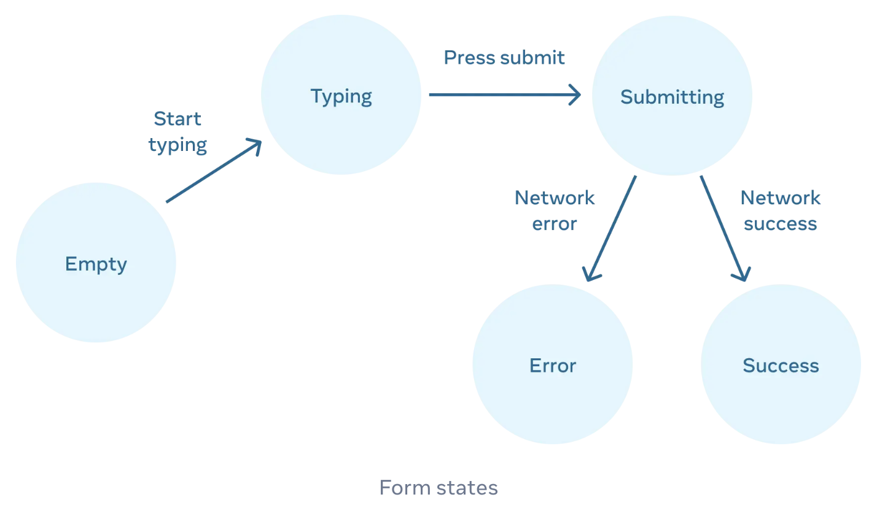

# Week 05

## [Reaching to Input with State](https://react.dev/learn/reacting-to-input-with-state)

> **Summary**
>
> - React는 UI를 선언적으로(declaratively) 표현하므로, 원하는 UI 상태를 정의하기만 하면 어떤 UI를 어떻게 변경할 지 구체적인 구현은 React가 처리한다.
> - React component는 state machine 처럼 state에 따라 UI가 변경될 수 있게 설계한다.
> - Visual states는 가능한 적은 개수로 UI를 그리는 데에 꼭 필요한 state만 선언한다.
>   - 불가능한 state 조합을 제거하기 위해, 서로 다른 state들을 하나로 합칠 수 있다.
>   - 어떤 state가 표현하는 정보가 다른 state를 통해서도 얻을 수 있다면, 중복되는 state는 제거한다.
> - 특정 interaction을 state 변경으로 연결시키면, 기존 코드를 변경하지 않고 새로운 visual state를 추가하기 쉬워진다.
>   - Event handler에서 state 변경을 처리한다.

### Declaative UI와 imperative UI

- **Imperative programming** 방식에서는 interaction을 어떻게 구현할 지 직접 명시
  - 각 UI element에 대한 변경사항을 어떻게 적용할 것인지 **구체적인 구현을 직접 명령(command)**
  - 이 방식은 복잡한 system에서 상태를 관리하기 어려움
- **Declarative programming** 방식에서는 원하는 상태를 정의하기만 함
  - 화면에 보여주고 싶은 UI 상태를 정의하면, **UI를 어떻게 변경할 것인지 구체적인 구현은 React가 처리**

### Thinking about UI declaratively

- Form에서 user action에 따라 UI가 변경되는 시나리오
  - Form에 값을 입력했을 때 "Submit" 버튼이 enabled 됨
  - "Submit" 버튼을 누르면 form과 button이 disabled 되고 spinner가 나타남
  - Network request가 성공하면 form이 숨겨지고 "Thank you" message가 나타남
  - Network request가 실패하면 error message가 나타나고 form이 다시 enabled 됨
- Imperative UI 방식에서는 각 단계에서 interaction에 따라 UI 변경을 직접 처리함
- Declarative UI 방식(React)에서는 아래 단계를 거쳐 UI를 변경함
  1. Component의 visual states 정의
  2. State 변경을 trigger하는 user actions 정의
  3. `useState`로 state를 memory에 저장
  4. 불필요한 state 삭제
  5. Event handler를 state setter에 연결

### 1. Component의 visual states 정의

- React는 visual states를 **state machine**으로 처리함
- Form UI 변경 예시에서 visual states
  - Empty : disabled button
  - Typing : enabled button
  - Submitting : disabled button 및 spinner
  - Success : Form 대신 "Thank you" message 표시
  - Error : enabled button과 error message 표시
- 각 visual state에 따라 UI를 다르게 그리는 React component 정의
  ```javascript
  // Try 'submitting', 'error', 'success':
  export default function Form({ status = "empty" }) {
    if (status === "success") {
      return <h1>That's right!</h1>;
    }
    return (
      <>
        <h2>City quiz</h2>
        <p>
          In which city is there a billboard that turns air into drinkable
          water?
        </p>
        <form>
          <textarea disabled={status === "submitting"} />
          <br />
          <button disabled={status === "empty" || status === "submitting"}>
            Submit
          </button>
          {status === "error" && (
            <p className="Error">Good guess but a wrong answer. Try again!</p>
          )}
        </form>
      </>
    );
  }
  ```
- Component를 이렇게 만들면 각 visual state에 대해 그려지는 UI를 한 번에 확인할 수 있음 (e.g. storybooks)
  ```javascript
  import Form from "./Form.js";
  let statuses = ["empty", "typing", "submitting", "success", "error"];
  export default function App() {
    return (
      <>
        {statuses.map((status) => (
          <section key={status}>
            <h4>Form ({status}):</h4>
            <Form status={status} />
          </section>
        ))}
      </>
    );
  }
  ```

### 2. State 변경을 trigger하는 user actions 정의

- State를 변경하는 input은 두 종류로 구분
  - Human inputs : click, typing, navigating 등
  - Computer inputs : network response, timeout, image loading 등
- Input이 발생했을 때 UI를 갱신하려면 state를 변경해야 함
- Form UI 변경 예시에서 각 input 별 state 변경
  
  - Text input 변경 : "Typing" or "Empty"
  - Submit button 클릭 : "Submitting"
  - Successful response : "Success"
  - Failed response : "Error"

### 3. `useState`로 state를 memory에 저장

- `useState`를 사용해서 component의 visual states들을 memory에 저장
  ```JavaScript
  const [isEmpty, setIsEmpty] = useState(true);
  const [isTyping, setIsTyping] = useState(false);
  const [isSubmitting, setIsSubmitting] = useState(false);
  const [isSuccess, setIsSuccess] = useState(false);
  const [isError, setIsError] = useState(false);
  ```
- 이 때, 가능한 적은 수의 state를 가져야 한다.
  ```javascript
  const [answer, setAnswer] = useState("");
  const [error, setError] = useState(null);
  ```
  - State 개수가 많아지면 복잡도가 높아지고 버그도 발생하기 쉬워진다.
    > - State가 Boolean type이라고 가정했을 때, state 1개 당 처리해야 하는 조합이 2배씩 증가함
    > - 즉, n개의 상태에 대해 2^n개의 조합을 처리해야 하므로 state가 많아지면 복잡도가 기하급수적으로 증가함
    > - 복잡도가 높아질수록 버그도 발생하기 쉬워진다.

### 4. 불필요한 state 삭제

- 꼭 필요한 state만 남겨야 component가 더 이해하기 쉬워지고, 중복 코드를 줄일 수 있고, 의도하지 않은 동작을 피할 수 있음
- State가 사용자에게 보여주고 싶은 UI를 보여주지 못하는 상황을 방지해야 함
  - ❌ Error message가 보이는데 input이 disable 되는 상태
  - ❌ 사용자가 error를 수정하고 error message를 없애지 못하는 상태
- State variables를 검증하는 방법
  - State가 paradox를 유발하는가?
    - Paradox : state가 충분히 제한되지 않은 상태
    - `isTyping`과 `isSubmitting`은 4개의 상태 조합이 존재하지만, 3개만 유효함
      - `isTyping`과 `isSubmitting`은 동시에 `true`가 될 수 없음
    - 불가능한 상태 조합을 제거하려면 `isTyping`과 `isSubmitting` 등 2개 state를 1개로 합쳐야 함
      - `typing`, `submitting`, `success` 값을 갖는 `status` state로 사용
  - 다른 state에서 동일한 정보를 표현할 수 있는가?
    - `isEmpty`와 `isTyping`도 동시에 `true`가 될 수 없음
    - 이 경우에도 state를 1개로 합쳐야 하는데, `isEmpty`를 제거하고 `answer.length === 0`으로 대체할 수 있음
  - 상반된 다른 state 로부터 동일한 정보를 얻을 수 있는가?
    - `isError`는 `error !== null`로 대체할 수 있음
- 위와 같이 검증하면 `isEmpty`, `isTyping`, `isSubmitting`, `isSuccess`, `isError` 등 5개의 state는 아래와 같이 3개로 줄일 수 있음
  ```javascript
  const [answer, setAnswer] = useState("");
  const [error, setError] = useState(null);
  const [status, setStatus] = useState("typing"); // 'typing', 'submitting', or 'success'
  ```
- **Reducer**를 사용하면 multiple state를 single object로 통합하고 관련된 logic을 한 곳에서 처리할 수 있음

### 5. Event handler를 state setter에 연결

- Human input의 경우 event handler를 연결해서 state를 변경
  ```javascript
  async function handleSubmit(e) {
    e.preventDefault();
    setStatus("submitting");
    try {
      await submitForm(answer);
      setStatus("success");
    } catch (err) {
      setStatus("typing");
      setError(err);
    }
  }
  ```
- 모든 interaction을 state 변경으로 표현하면 나중에 새 visual state를 추가할 때 쉽게 확장할 수 있음

## [Choosing the State Structure](https://react.dev/learn/choosing-the-state-structure)

> **Summary**
>
> - 항상 같이 변경하는 state는 하나로 합친다.
> - 모순되는 state 조합이 발생하지 않도록 만든다. 가능한 status만 표현하는 state 1개로 합친다.
> - 불필요한 state, 또는 다른 state 값과 중복되는 state를 만들지 않는다. Sync를 유지하지 않아도 되게 만든다.
> - Component UI를 변경하는 데에 사용되는 prop을 state로 만들지 않는다. (Don't mirror props in state)
> - Selection 등의 UI pattern에서는 object 대신 ID나 Index 값을 state로 사용한다.
> - State가 너무 깊게 중첩해서 복잡하다면 평평하게 만든다. (flatten or normalize)

- State를 잘 구조화하면 component를 수정하고 debug하기 쉬워짐
- Component를 작성할 때 state variables 개수와 data 구조를 결정할 떄 참고할 수 있는 원칙(principle)이 있음
- 이 원칙들은 실수 없이 state를 변경하고 여러 state 간 sync를 유지하기 쉽게 도와준다.

### 1. Group related state

```javascript
// ❌
const [x, setX] = useState(0);
const [y, setY] = useState(0);

// ✅
const [position, setPosition] = useState({ x: 0, y: 0 });
```

- 항상 둘 이상의 state를 함께 변경한다면 state 하나로 합치는 것을 고려한다.
- 해당 state들 중 일부를 변경하지 않는 실수를 방지할 수 있다.

### 2. Avoid contradictions in state

```javascript
// ❌
const [text, setText] = useState("");
const [isSending, setIsSending] = useState(false);
const [isSent, setIsSent] = useState(false);

// ✅
const [text, setText] = useState("");
const [status, setStatus] = useState("typing"); // 'typing', 'sending', 'sent'

// 기존 상태를 non-state variables로 표현 가능
const isSending = status === "sending";
const isSent = status === "sent";
```

- State들이 서로 모순되지 않도록 만든다.
- `isSending`과 `isSent` 두 개의 state를 사용하는 경우, 둘 중 하나를 `false`로 변경하는 것을 잊어버리면 두 상태가 모두 `true`가 될 수 있다.
- State 두 개를 사용하면 불가능한 조합이 발생할 수 있으므로, 이 두 state를 하나로 합쳐서 가능한 상태만 표현할 수 있도록 만든다.

### 3. Avoid redundant state

```javascript
// ❌
const [firstName, setFirstName] = useState("");
const [lastName, setLastName] = useState("");
const [fullName, setFullName] = useState(""); // firstName과 lastName으로 계산 가능

// ✅
const [firstName, setFirstName] = useState("");
const [lastName, setLastName] = useState("");
```

- Component props 또는 기존 state로 계산할 수 있는 정보는 component state로 저장하지 않는다.
- 이 때, **props로 state를 만들지 않는다. (Don't mirror props in state)**
  ```javascript
  function Message({ messageColor }) {
    const [color, setColor] = useState(messageColor);
    // ...
  }
  ```
  - 부모 component에서 `messageColor`로 다른 값을 전달할 때, `color` state에 반영되지 않는다.
  - 특정 props에 대한 변경을 모두 무시하려는 경우에만 이 방식을 사용한다.
    ```javascript
    function Message({ initialColor }) {
      // The `color` state variable holds the *first* value of `initialColor`.
      // Further changes to the `initialColor` prop are ignored.
      const [color, setColor] = useState(initialColor);
      // ...
    }
    ```
    - 이 때, `props` 이름은 `initial~` 또는 `default~`로 짓는 convention 적용

### 4. Avoid duplication in state

```javascript
// ❌ : 두 state가 동일한 object를 가질 수 있음
const [items, setItems] = useState(initialItems);
const [selectedItem, setSelectedItem] = useState(items[0]);

// ...

//
<button
  onClick={() => {
    setSelectedItem(item);
  }}
>
  Choose
</button>;

// ✅
const [items, setItems] = useState(initialItems);
const [selectedId, setSelectedId] = useState(0);

// 선택된 item은 rendering 중 계산할 수 있으므로, 이 계산에 필요한 id만 state로 저장
const selectedItem = items.find((item) => item.id === selectedId);

// ...
<button
  onClick={() => {
    setSelectedId(item.id);
  }}
>
  Choose
</button>;
```

- 동일한 data가 여러 state들에 중복되지 않도록 만든다. (Sync를 유지하기 어려움)

### 5. Avoid deeply nested state

```javascript
// ❌
export const initialTravelPlan = {
  id: 0,
  title: "(Root)",
  childPlaces: [
    {
      id: 1,
      title: "Earth",
      childPlaces: [
        {
          id: 2,
          title: "Africa",
          childPlaces: [...],
        },
        {
          id: 10,
          title: "Americas",
          childPlaces: [...],
        },
        {
          id: 19,
          title: "Asia",
          childPlaces: [...],
        },
        {
          id: 26,
          title: "Europe",
          childPlaces: [...],
        },
        {
          id: 34,
          title: "Oceania",
          childPlaces: [...],
        },
      ],
    },
    {
      id: 42,
      title: "Moon",
      childPlaces: [...],
    },
    {
      id: 46,
      title: "Mars",
      childPlaces: [...],
    },
  ],
};

// ✅ : 평평한 구조로 변경 (flatten or normalized)
export const initialTravelPlan = {
  0: {
    id: 0,
    title: "(Root)",
    childIds: [1, 42, 46],
  },
  // ... 1 ~ 47
  48: {
    id: 48,
    title: "Green Hill",
    childIds: [],
  },
};
```

- 깊은 계층구조를 가진 state는 update하기 어려우므로, 가능한 평평하게(flat) 만든다.
- 객체 state의 깊이는 얼마든지 깊어질 수 있지만, flat하게 만들수록 여러 가지 문제들을 해결할 수 있다.
- Flatten state는 쉽게 변경할 수 있고 다른 nested object에서 data가 중복되지 않도록 한다.

## [Sharing State Between Components](https://react.dev/learn/sharing-state-between-components)

> **Summary**
>
> - Component 간에 공유해야 하는 shared state는 parent로 올리고(lift up), props를 통해 children으로 내려준다(pass down).
> - 특정 component에 정의한 state를 parent로 끌어올리거나 children의 local state로 내려주면서 'Single source of truth' 원칙에 따라 state를 소유할 component를 결정한다.
> - Component를 작성할 때 controlled 또는 uncontrolled로 만들지 결정한다.
>   - Controlled : Component render 결과를 결정하는 정보를 props를 통해 parent 로부터 전달받는 component
>   - Uncontrolled : Component가 render 결과로 보여줄 정보들을 local state로 관리하는 component
>   - 유연성(flexibility)과 사용 편의성을 고려해서 결정한다.

### Lifting State Up

- Component가 개별적으로 state를 가지면 두 component는 독립적으로 동작함

  ```javascript
  import { useState } from 'react';

  function Panel({ title, children }) {
    const [isActive, setIsActive] = useState(false);
    return (...);
  }

  export default function Accordion() {
    // 'About' panel에서 `isActive` 상태 변경이 'Etymology' panel에 영향을 미치지 않음
    return (
      <>
        <h2>Almaty, Kazakhstan</h2>
        <Panel title="About">...</Panel>
        <Panel title="Etymology">...</Panel>
      </>
    );
  }
  ```

- 두 component가 항상 함께 변경되어야 한다면 두 component의 가장 가까운 공통 부모로 state를 옮기고 props로 전달

  ```javascript
  import { useState } from "react";

  export default function Accordion() {
    const [activeIndex, setActiveIndex] = useState(0);
    return (
      <>
        <h2>Almaty, Kazakhstan</h2>
        <Panel
          title="About"
          isActive={activeIndex === 0}
          onShow={() => setActiveIndex(0)}
        >
          ...
        </Panel>
        <Panel
          title="Etymology"
          isActive={activeIndex === 1}
          onShow={() => setActiveIndex(1)}
        >
          ...
        </Panel>
      </>
    );
  }

  function Panel({ title, children, isActive, onShow }) {
    return (
      <section className="panel">
        <h3>{title}</h3>
        {isActive ? <p>{children}</p> : <button onClick={onShow}>Show</button>}
      </section>
    );
  }
  ```

### Controlled and uncontrolled components

- Uncontrolled component : Local state를 갖는 component. Parent가 상태 변경에 영향을 미치지 않음
- Controlled component : 중요한 정보가 local state가 아닌 props를 통해 다뤄지는 component
- Uncontrolled component는 쉽게 사용할 수 있지만 유연성은 떨어짐
- Controlled component는 가장 유연하지만 parent components가 props로 상태를 관리해야 함
- Component를 작성할 때, 어떤 정보를 controlled로 관리할 지(props로 전달할 지) 또는 uncontrolled로 관리할 지(local state로 관리할 지) 고려해야 함

### The single source of truth for each state

- **Single source of truth** : state는 특정 component가 가지고 관리한다는 원칙
- SSoT 원칙에 따라 state를 소유할 component를 결정해야 함
- Shared state를 여러 component에서 중복으로 정의하는 대신, state를 parent로 lift up 하고 props를 통해 children으로 pass down
