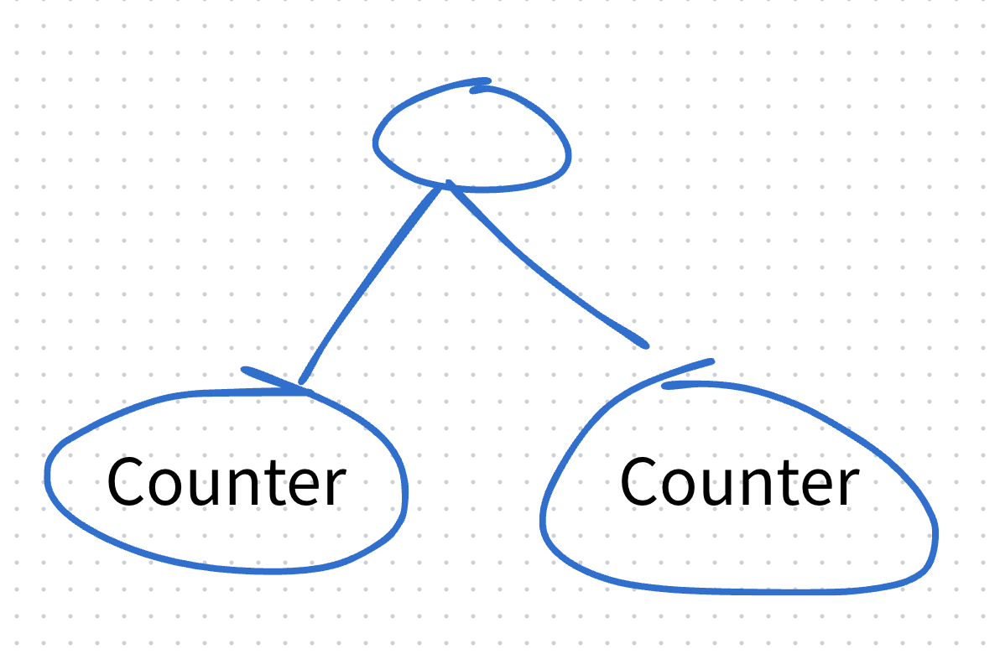
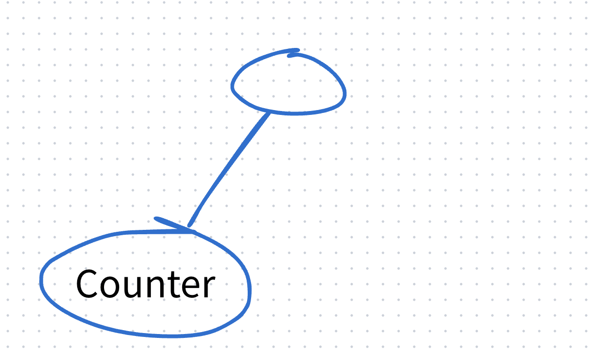

# Preserving and Resetting State

## 상태는 컴포넌트 안에 저장되는 것처럼 보이지만, 실제로는 React가 **렌더 트리에서의 위치**와 연결해서 관리한다.

```jsx
import { useState } from "react";

export default function App() {
  const counter = <Counter />;
  return (
    <div>
      {counter}
      {counter}
    </div>
  );
}

function Counter() {
  const [score, setScore] = useState(0);
  const [hover, setHover] = useState(false);

  let className = "counter";
  if (hover) {
    className += " hover";
  }

  return (
    <div
      className={className}
      onPointerEnter={() => setHover(true)}
      onPointerLeave={() => setHover(false)}
    >
      <h1>{score}</h1>
      <button onClick={() => setScore(score + 1)}>Add one</button>
    </div>
  );
}
```

같은 `Counter` 컴포넌트를 두 번 렌더링하면, 트리에서 서로 다른 두 위치에 배치되기 때문에 각각 독립된 `score, hover`를 가진다.

## React는 트리의 동일한 위치에서 동일한 컴포넌트를 렌더링하는 동안 상태를 유지한다.

```jsx
import { useState } from "react";

export default function App() {
  const [showB, setShowB] = useState(true);
  return (
    <div>
      <Counter />
      {showB && <Counter />}
    </div>
  );
}
```



`showB === false`일 때



렌더 트리에서 아예 제거됨 -> 다시 생겨도 렌더 트리 입장에서는 새로운 위치의 새로운 컴포넌트 -> Counter 내의 state들이 유지되지 않음

```jsx
export default function App() {
  const [isFancy, setIsFancy] = useState(false);

  return (
    <div>
      {isFancy ? <Counter isFancy={true} /> : <Counter isFancy={false} />}
    </div>
  );
}
```

위 코드 같은경우에 같은 위치(div태그의 첫번째 자식요소 위치)에 같은 `Counter` 컴포넌트에 props만 다르게 전달해주고 있다.

따라서 이 상황은 state가 유지된다.

## 동일한 위치에서 다른 컴포넌트 일 때는 상태를 초기화한다.

```jsx
import { useState } from "react";

export default function App() {
  const [isPaused, setIsPaused] = useState(false);
  return <div>{isPaused ? <p>See you later!</p> : <Counter />}</div>;
}
```

`isPaused`에 따라서 같은 위치에 다른 컴포넌트를 렌더링 하고 있는데, 조건이 바뀔 때 트리에서 삭제하고 다른 컴포넌트를 추가하는 흐름이다. 이땐 state가 초기화된다.

```jsx
import { useState } from "react";

export default function App() {
  const [isPaused, setIsPaused] = useState(false);
  return (
    <main>
      {isPaused ? (
        <div>
          <Counter />
        </div>
      ) : (
        <section>
          <Counter />
        </section>
      )}
    </main>
  );
}
```

위 예시도 main의 첫번째 자식의 태그가 div, section으로 다르기 때문에 조건에 의해서 렌더 트리에서 렌더링될 때 그 자식인 `Counter`도 함께 제거가 된다. -> state 유지 x

따라서 state를 리렌더링시에 유지하려면 트리 구조가 같아야한다.

## state 공유하지 않기

```jsx
import { useState } from "react";

export default function Scoreboard() {
  const [isPlayerA, setIsPlayerA] = useState(true);
  return (
    <div>
      {isPlayerA ? <Counter person="Taylor" /> : <Counter person="Sarah" />}
    </div>
  );
}
```

이제 위 코드만 봐도 동일한 위치의 동일한 컴포넌트를 렌더링하기에 `Counter`의 state들이 유지될 것을 예측할 수 있다.

하지만 person에 따라서 state를 초기화 해야 되는 상황이 필요하다고 가정하자.

### 1. 다른 위치에 렌더링

```jsx
import { useState } from "react";

export default function Scoreboard() {
  const [isPlayerA, setIsPlayerA] = useState(true);
  return (
    <div>
      {isPlayerA && <Counter person="Taylor" />}
      {!isPlayerA && <Counter person="Sarah" />}
    </div>
  );
}
```

**내가 헷갈린 부분**

위 코드에서 `isPlayerA`에 따라서 둘 중 하나는 항상 false니까 없어진다고 생각을 했다.

그래서 아래 코드 예시처럼결국 div의 첫번째 자식 위치에 같은 `Counter` 컴포넌트가 아닌가? 의문이 들었다.

```jsx
// isPlayerA가 true일 때
<div>
  <Counter person="Taylor" />
</div>
```

```jsx
// isPlayerA가 false일 때
<div>
  <Counter person="Sarah" />
</div>
```

조금 더 자세히는 삼항연산자를 사용할 때처럼 아래 코드와 같은 논리 아닌가?

```jsx
<div>
  <Counter person={isPlayerA ? "Taylor" : "Sarah"} />
</div>
```

### 2. key를 명시해주기

```jsx
import { useState } from "react";

export default function Scoreboard() {
  const [isPlayerA, setIsPlayerA] = useState(true);
  return (
    <div>
      {isPlayerA ? (
        <Counter key="Taylor" person="Taylor" />
      ) : (
        <Counter key="Sarah" person="Sarah" />
      )}
    </div>
  );
}
```

key 값을 `Counter`에 주면서 둘은 다른 컴포넌트임을 명시하는 방법이 있다.

여기서 key는 유일한 값이지만 전역에서의 유일을 의미하는 것은 아니다. 부모 노드와 한 덩어리라고 생각하면 된다.

```jsx
function App() {
  const ids = ["1", "2", "3"];

  return (
    <>
      <ul>
        {ids.map((id) => (
          <li key={id}>List A item {id}</li>
        ))}
      </ul>

      <ul>
        {ids.map((id) => (
          <li key={id}>List B item {id}</li>
        ))}
      </ul>
    </>
  );
}
```

예시로 ids의 0,1,2가 각 li의 key로 고유하게 주어지겠지만 `<ul>` 내에서만 고유하다 라고 보는 것이다. 직관적으로 보면 아래 코드는 key가 같지만 다른 부모 노드를 가지고 있기 때문에 괜찮다.

```jsx
// 1
<li key="1">List A item 1</li>
// 2
<li key="1">List B item 1</li>
```

> 사라지고 나타났을 때 state 유지하기
>
> 1. 브라우저의 렌더링 과정중에 CSS를 다운로드하고 이를 그리는 CSS 속성에 따라서 페인팅하는 과정이 있었다. 이처럼 트리에서 컴포넌트를 제거하는 것이 아닌 CSS 속성을 통해서 보여지지 않게만 한다면 다시 보여질 때는 state가 유지된다.
>
> 2. state를 부모가 관리하면 자식 컴포넌트가 제거되어도 상관없다.
>
> 3. 브라우저 저장소 활용하기

# Extracting State Logic into a Reducer

## reducer

컴포넌트의 규모가 커짐에 따라 상태를 업데이트하는 핸들러가 많으면 복잡할 때가 있다.

```jsx
import { useState } from "react";

let nextId = 3;
const initialTasks = [
  { id: 0, text: "Visit Kafka Museum", done: true },
  { id: 1, text: "Watch a puppet show", done: false },
  { id: 2, text: "Lennon Wall pic", done: false },
];

export default function TaskApp() {
  const [tasks, setTasks] = useState(initialTasks);

  function handleAddTask(text) {
    setTasks([
      ...tasks,
      {
        id: nextId++,
        text: text,
        done: false,
      },
    ]);
  }

  function handleChangeTask(task) {
    setTasks(
      tasks.map((t) => {
        if (t.id === task.id) {
          return task;
        } else {
          return t;
        }
      })
    );
  }

  function handleDeleteTask(taskId) {
    setTasks(tasks.filter((t) => t.id !== taskId));
  }

  return (
    <>
      <h1>Prague itinerary</h1>
      <AddTask onAddTask={handleAddTask} />
      <TaskList
        tasks={tasks}
        onChangeTask={handleChangeTask}
        onDeleteTask={handleDeleteTask}
      />
    </>
  );
}
```

이럴 때 `reducer` 함수를 이용해서 모아서 관리할 수 있다. reducer를 사용하면 **상태를 직접 바꿔라** 보다는 **이러한 행동을 했다**를 action (객체 형태)로 dispatch, 보내서 알려주는 느낌이다.

### dispatch

```jsx
function handleAddTask(text) {
  dispatch({
    type: "added",
    id: nextId++,
    text: text,
  });
}

function handleChangeTask(task) {
  dispatch({
    type: "changed",
    task: task,
  });
}

function handleDeleteTask(taskId) {
  dispatch({
    type: "deleted",
    id: taskId,
  });
}
```

### reducer 설정

```jsx
function tasksReducer(tasks, action) {
  switch (action.type) {
    case "added": {
      return [
        ...tasks,
        {
          id: action.id,
          text: action.text,
          done: false,
        },
      ];
    }
    case "changed": {
      return tasks.map((t) => {
        if (t.id === action.task.id) {
          return action.task;
        } else {
          return t;
        }
      });
    }
    case "deleted": {
      return tasks.filter((t) => t.id !== action.id);
    }
    default: {
      throw Error("Unknown action: " + action.type);
    }
  }
}
```

### useState -> useReducer

```jsx
import { useReducer } from "react";

let nextId = 3;
const initialTasks = [
  { id: 0, text: "Visit Kafka Museum", done: true },
  { id: 1, text: "Watch a puppet show", done: false },
  { id: 2, text: "Lennon Wall pic", done: false },
];

export default function TaskApp() {
  const [tasks, dispatch] = useReducer(tasksReducer, initialTasks);

  function handleAddTask(text) {
    dispatch({
      type: "added",
      id: nextId++,
      text: text,
    });
  }

  function handleChangeTask(task) {
    dispatch({
      type: "changed",
      task: task,
    });
  }

  function handleDeleteTask(taskId) {
    dispatch({
      type: "deleted",
      id: taskId,
    });
  }

  return <></>;
}
```

## useState vs useReducer

| 항목      | useState                                                                                                   | useReducer                                                                                                          |
| --------- | ---------------------------------------------------------------------------------------------------------- | ------------------------------------------------------------------------------------------------------------------- |
| 코드 크기 | 작성해야 할 코드 양이 더 적다.                                                                             | reducer 함수와 dispatch용 action을 추가로 작성해야 해서 초기 코드가 많다                                            |
| 가독성    | 단순한 state일 때는 읽기 쉽지만, 구조가 복잡해질수록 컴포넌트 안 코드가 길어져 한눈에 파악하기 어려워진다. | 로직이 분리되어 있어 복잡한 상태일수록 동작 흐름을 더 명확하게 읽을 수 있다.                                        |
| 디버깅    | state가 어디서, 왜 잘못 설정됐는지 추적하기가 상대적으로 어렵다.                                           | reducer 내부에 로그를 넣어 모든 업데이트와 관련 action을 확인할 수 있어, 문제가 reducer 로직인지 쉽게 좁힐 수 있다. |
| 테스팅    | 주로 컴포넌트 단위 테스트에 의존                                                                           | state와 action에 대해 반환값을 독립적으로 테스트하기 좋다.                                                          |

## reducer 주의

reducer는 같은 입력이면 항상 같은 출력만 내는 순수 함수여야 한다. 렌더링 중에 실행되므로, 요청 보내기·타이머·DOM 조작 같은 side effect를 하면 안된다.

action 로그만 봐도 사용자 상호작용 흐름을 재구성할 수 있게, action은 **의미 있는 한 번의 행동**
단위로 설계하는 게 좋다.
