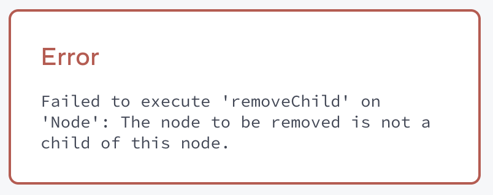

# Week 07

## [Referencing Values with Refs](https://react.dev/learn/referencing-values-with-refs)

> **Summary**
>
> - Ref object는 `current` property를 갖는 mutable한 일반적인 JavaScript object로, React가 rendering에 사용하지 않으므로 값 변경을 추적하지 않음
> - Re-rendering 되어도 값을 유지하지만 값읇 변경해도(`ref.current` 변경) component를 re-render 하지 않을 때 사용
> - `useRef(initialValue)` hook으로 ref object 생성
> - Refs는 app 외부의 external system이나 Web APIs와 함께 사용하면 좋음
>   - `setTimeout` 사용 시 timer ID 저장
>   - JSX의 `ref` attribute에 전달하여 DOM element에 접근
> - Ref 객체를 rendering 중에 읽거나 쓰지 않도록 주의. Event handler 또는 `useEffect` callback 안에서 사용한다.

---

- `ref` : React가 추적하지 않는 mutable value
  - React의 단방향(one-way) data flow를 벗어남 (escape hatch)
  - `current` property를 갖는 일반적인 JavaScript object
  - Mutable value이므로 `current` 값을 직접 변경할 수 있음
  - Rendering 중에 `ref.current` 값을 읽으면 안됨 (event handler나 `useEffect` callback에서 접근)
- State와 비교
  - `ref`는 state처럼 re-render 간에 값이 유지되지만, **state와 달리 값을 변경해도 re-render를 trigger 하지 않음**
  - **Re-rendering을 trigger 하지 않으면서 component에 data를 저장하고 싶을 때** 사용
- `useRef(initialValue)` hook을 사용해서 `ref` object를 생성하고, `ref.current`로 값 사용

  ```javascript
  import { useRef } from "react";

  export default function Counter() {
    let ref = useRef(0);

    function handleClick() {
      ref.current = ref.current + 1;
      alert("You clicked " + ref.current + " times!");
    }

    return <button onClick={handleClick}>Click me!</button>;
  }
  ```

- State와 `ref`를 함께 사용하는 예시

  ```javascript
  import { useState, useRef } from "react";

  export default function Stopwatch() {
    // Rendering에 사용하는 값은 state 사용
    const [startTime, setStartTime] = useState(null);
    const [now, setNow] = useState(null);

    // 값 변경이 re-render를 필요로 하지 않는 경우 ref 사용
    const intervalRef = useRef(null);

    function handleStart() {
      setStartTime(Date.now());
      setNow(Date.now());

      clearInterval(intervalRef.current);
      intervalRef.current = setInterval(() => {
        setNow(Date.now());
      }, 10);
    }

    function handleStop() {
      clearInterval(intervalRef.current);
    }

    // 'Start' 버튼을 누를 때마다 re-render 되면서 값이 초기화될 것
    let secondsPassed = 0;
    if (startTime != null && now != null) {
      secondsPassed = (now - startTime) / 1000;
    }

    return (
      <>
        <h1>Time passed: {secondsPassed.toFixed(3)}</h1>
        <button onClick={handleStart}>Start</button>
        <button onClick={handleStop}>Stop</button>
      </>
    );
  }
  ```

### How does useRef work inside?

- `useRef`는 `useState`를 기반으로 구현됨
  ```javascript
  function useRef(initialValue) {
    const [ref, unused] = useState({ current: initialValue });
    return ref;
  }
  ```
  - 첫 번째 render 동안 `useRef`는 **'state variable'** 인 `{ current: initialValue }` object를 반환
  - Object가 React에 의해 state로 저장되므로, next render에서 동일한 object가 반환됨
  - 이 때, `useRef`는 항상 같은 object를 반환하므로 setter 함수는 필요 없음 (`unused`)
- 즉, `ref`는 setter가 없는 regular state variable

### Best practices for refs

- Refs를 'escape hatch'로 다룬다.
  - Refs는 external system을 다루거나 browser API와 함께 사용할 때 유용하다.
  - Application logic과 data flow 등은 refs에 의존하지 않는게 좋다.
- `ref.current`를 rendering 중에 읽거나 쓰지 않는다.
  - Rendering 중에 필요한 data는 state로 관리한다.
  - React는 `ref.current`가 변경되는 것을 알지 못하므로, rendering 중에 `ref.current` 값을 읽으면 component가 예상치 못하게 동작할 수 있다.
  - 단, 첫 번째 render에서 한 번만 값을 쓰는 것은 가능하다.
    ```javascript
    // Ref 초깃값이 falsy일 때(`null` 또는 `undefined`) 첫 번쨰 render에서만 아래 구문 실행.
    // 두 번째 render 부터는 `ref.current`에 truthy 값이 할당되어 있음
    if (!ref.current) {
      ref.current = new Thing();
    }
    ```
- Every render 마다 snapshot 처럼 동작하는 state와 달리, ref는 변경하는 즉시 값이 반영된다.
  ```javascript
  ref.current = 5;
  console.log(ref.current); // 항상 5
  ```
- Ref object는 rendering에 사용되지 않기 때문에, React는 ref를 신경쓰지 않는다.

### Refs and the DOM

- Ref는 DOM element에 접근할 때 주로 사용됨
- JSX의 `ref` attribute에 ref object를 전달하면, React가 해당하는 DOM element를 `ref.current`에 할당해 줌
- DOM element가 제거되면 React가 `ref.current`를 `null`로 초기화

## [Manipulating the DOM with Refs](https://react.dev/learn/manipulating-the-dom-with-refs)

> **Summary**
>
> - JSX element의 `ref` attribute에 `useRef`로 만든 ref object를 전달하면, React가 DOM node가 준비 되었을 때 `ref.current`에 DOM node를 할당해 준다.
> - 이 때, DOM node 할당은 'commit phase'에 이루어지므로 rendering 중간에 ref object에 접근해서 Web API를 호출하면 안 된다.
> - `Array.map()`을 사용해서 동적으로 rendering하는 list item들의 DOM node는 다른 방법을 사용해야 한다.
>   1. List item 들의 parent element에 `ref`를 설정해서 DOM node를 얻고, `querySelectorAll`을 사용해서 list item의 DOM node에 접근
>   2. `ref` attribute에 callback 함수를 전달해서 DOM node를 받고, 이것을 `Map` 자료구조로 관리 (React 19부터 지원하는 '**ref callback**' 사용)
> - Parent component가 child component 내부의 element에 대한 DOM node에 접근하고 싶다면 `ref` prop을 통해 ref object를 전달한다.
>   - 이 때, child component는 `useImperativeHandle` hook을 사용해서 parent에 노출(expose)할 interface를 직접 정의할 수 있다. (외부에서 접근할 수 있는 기능 제한)
> - Ref를 state와 함께 사용할 때 state와 sync가 맞지 않는 문제가 발생한다면 `flushSync` 함수를 사용해서 React가 state 변경을 동기적으로 즉시 반영하도록 강제할 수 있다.
> - Refs는 'escape hatch' 이므로 React의 rendering과 무관하게 동작한다. 따라서, **React가 추가/수정/삭제하는 element는 ref를 통해 DOM node를 직접 조작하지 않도록 주의**해야 한다.

---

- React는 render output과 일치하도록 DOM을 자동 update 해 주기 때문에 직접 DOM element를 다루는 일은 드물다.
- 하지만, node에 focus 하거나 size 및 position을 측정하려는 경우 **React에 의해 관리되는 DOM element에 직접 접근**해야 할 수도 있다.
- JSX의 `ref` attribute에 `useRef`가 반환한 ref object를 전달하면, React가 DOM node를 생성할 때 참조를 `ref.current`에 할당
- Mount and render 이후, ref 객체를 통해 DOM node에 접근하거나 API를 호출하면 안 된다.
  ```javascript
  ref.current.scrollIntoView(); // Use any browser APIs
  ```
- `ref`를 통해 `<input />`을 코드로 focus 시키는 예시

  ```javascript
  import { useRef } from "react";

  export default function Form() {
    // <input> element의 DOM node를 참조할 ref object 생성
    const inputRef = useRef(null);

    function handleClick() {
      // Event handler 실행 시점에는 rendering 및 `ref.current` 값 할당이 완료된 상태
      // `current`로 Input DOM node에 접근해서 Web API 사용
      inputRef.current.focus();
    }

    return (
      <>
        <input ref={inputRef} />
        <button onClick={handleClick}>Focus the input</button>
      </>
    );
  }
  ```

- `ref`를 통해 특정 element로 스크롤하는 예시

  ```javascript
  import { useRef } from "react";

  const SCROLL_OPTIONS_SMOOTH_CENTER = {
    behavior: "smooth",
    block: "nearest",
    inline: "center",
  };

  export default function CatFriends() {
    const firstCatRef = useRef(null);
    const secondCatRef = useRef(null);
    const thirdCatRef = useRef(null);

    function handleScrollToFirstCat() {
      firstCatRef.current.scrollIntoView(SCROLL_OPTIONS_SMOOTH_CENTER);
    }

    function handleScrollToSecondCat() {
      secondCatRef.current.scrollIntoView(SCROLL_OPTIONS_SMOOTH_CENTER);
    }

    function handleScrollToThirdCat() {
      thirdCatRef.current.scrollIntoView(SCROLL_OPTIONS_SMOOTH_CENTER);
    }

    return (
      <>
        <nav>
          <button onClick={handleScrollToFirstCat}>Neo</button>
          <button onClick={handleScrollToSecondCat}>Millie</button>
          <button onClick={handleScrollToThirdCat}>Bella</button>
        </nav>
        <div>
          <ul>
            <li>
              
            </li>
            <li>
              
            </li>
            <li>
              
            </li>
          </ul>
        </div>
      </>
    );
  }
  ```

### How to manage a list of refs using a ref callback

- List(array)의 각 item에 대해 ref를 동적으로 생성해야 할 수도 있음
- Hook은 component의 top-level 에서만 호출할 수 있으므로 아래와 같이 작성할 수 없음
  ```javascript
  <ul>
    {items.map((item) => {
      // Doesn't work!
      const ref = useRef(null);
      return <li ref={ref} />;
    })}
  </ul>
  ```
- 이런 경우에는 **parent element에 대해 `ref`를 1개만 얻고, `querySelectorAll` 같은 DOM 조작 methods를 사용해서 특정 list item에 해당하는 DOM node에 접근**해야 함
- 또는, React 19부터 제공되는 **ref callback**을 사용
  - `ref` attribute에 ref object 대신 callback 함수를 전달
  - `ref.current`가 설정되었을 때 parameter로 DOM node 객체가 전달됨
  - DOM node가 cleanup 되는 시점에 callback 함수에서 반환한 cleanup 함수를 실행
  - Ref callback과 cleanup function을 사용해서 list item들을 `Map`으로 관리할 수 있음
    ```javascript
    export default function CatFriends() {
      // Ref가 DOM node 대신 list item들에 대한 ref를 관리하기 위한 Map을 저장
      const itemsRef = useRef(null);
      function getMap() {
        if (!itemsRef.current) {
          itemsRef.current = new Map();
        }
        return itemsRef.current;
      }
      // ...
    }
    ```
  - `map()` method를 통해 동적으로 rendering되는 element에서 `ref` callback을 통해 `ref` 객체를 `Map`에 저장하고, cleanup 시점에는 `Map`에서 제거
    ```javascript
    export default function CatFriends() {
      const [catList, setCatList] = useState(setupCatList);
      // ...
      return (
        <>
          {/*...*/}
          <div>
            <ul>
              {catList.map((cat) => (
                <li
                  key={cat.id}
                  ref={(node) => {
                    // List item들에 대한 DOM node를 `Map` ref로 관리
                    const map = getMap();
                    map.set(cat, node);
                    // ⚠️ DOM node가 cleanup 될 때 `Map`에서도 제거해야 함
                    return () => map.delete(cat);
                  }}
                >
                  
                </li>
              ))}
            </ul>
          </div>
        </>
      );
    }
    ```
  - 각 list item에 대해 Web API를 사용하려면 `itemsRef`에서 `Map`을 통해 DOM node에 접근
    ```javascript
    // 특정 고양이로 scroll 시키는 click event handler
    function scrollToCat(cat) {
      const map = getMap();
      const node = map.get(cat);
      node.scrollIntoView({
        behavior: "smooth",
        block: "nearest",
        inline: "center",
      });
    }
    ```

### Accessing another component's DOM node

```javascript
import { useRef } from "react";

function MyInput({ ref }) {
  return <input ref={ref} />;
}

export default function MyForm() {
  const inputRef = useRef(null);

  function handleClick() {
    inputRef.current.focus();
  }

  return (
    <>
      <MyInput ref={inputRef} />
      <button onClick={handleClick}>Focus the input</button>
    </>
  );
}
```

- Parent component에서 `useRef`로 생성한 ref object를 prop을 통해 child component로 전달할 수 있음
- 이와 같은 구조에서 parent component는 child component 내부의 특정 DOM node를 조작할 수 있음
  - `focus()` 등 Web API 호출
  - CSS style 변경
- Parent component에서 전달한 `ref`가 허용한 기능만 실행할 수 있도록 제한하고 싶다면, child component에서 `ref`에 대해 `useImperativeHandle` hook을 사용해서 특정 기능만 노출(expose)할 수 있음

  - Child component는 내부에서 DOM node를 얻기 위해 자체적으로 ref object 생성
    ```javascript
    export default function MyInput({ ref }) {
      const realInputRef = useRef(null);
      // ...
      return <input ref={realInputRef} />;
    }
    ```
  - Parent component가 전달한 `ref` object에는 `useImperativeHandle(ref, createHandle)` hook을 사용해서 interface를 별도로 정의
    ```javascript
    export default function MyInput({ ref }) {
      // ...
      useImperativeHandle(ref, () => ({
        focus: () => {
          realInputRef.current.focus();
        },
        // 다른 메서드도 정의 가능
      }));
      // ...
    }
    ```
  - `useImperativeHandle`의 `createHandle`은 `ref`에 DOM node가 아닌 custom object를 할당

### When React attaches the refs

- React는 component update를 두 단계에 걸쳐 진행
  1. Render phase : component 함수를 호출해서 화면에 그릴 내용을 게산
  2. Commit phase : 변경사항을 실제 DOM에 반영
- DOM node는 'commit' phase에 `ref.current`에 할당됨
  - DOM을 update하기 이전에 React는 `ref.current`를 `null`로 할당
  - DOM updating이 끝난 직후 `ref.current`에 해당 element의 DOM node를 할당
- 따라서, rendering 중간에 `ref` object에 접근하거나 `ref.current`를 통해 DOM node에 접근하면 안됨
- 일반적으로 **event handler**에서 `ref.current`에 접근하고, 그 외에는 '**Effect**'를 사용해야 함

### Flushing state updates synchronously with flushSync

- State와 ref를 함께 사용할 때, state 변경과 ref 참조의 sycn가 맞지 않는 문제가 생길 수 있음
- Todo를 추가한 뒤 추가한 item element로 scroll하는 아래 코드에서, item이 추가되기 전에 scroll이 먼저 되는 문제가 있음

  ```javascript
  export default function TodoList() {
    const listRef = useRef(null);
    const [text, setText] = useState("");
    const [todos, setTodos] = useState(initialTodos);

    function handleAdd() {
      const newTodo = { id: nextId++, text: text };
      setText("");
      setTodos([...todos, newTodo]);
      listRef.current.lastChild.scrollIntoView({
        behavior: "smooth",
        block: "nearest",
      });
    }

    return (
      <>
        <button onClick={handleAdd}>Add</button>
        <input value={text} onChange={(e) => setText(e.target.value)} />
        <ul ref={listRef}>
          {todos.map((todo) => (
            <li key={todo.id}>{todo.text}</li>
          ))}
        </ul>
      </>
    );
  }
  ```

  - State 변경은 queue에 저장되었다가 next render에서 한 번에 처리되므로, `setTodos()` setter 함수로 state를 변경하더라도 `handleAdd` event handler가 종료되기 전까지는 state가 변경되지 않음 (snapshot 처럼 동작)
  - 따라서, **`setTodos()` 호출 직후 `listRef.current.lastChild`는 previous state를 기준으로 DOM node를 찾기 때문에**, 새 todo가 추가되기 이전 list에서 last child를 참조하여 발생하는 문제
  - 이 문제를 해결하려면 **React가 DOM을 동기적으로 갱신하도록("flush") 강제**해야 함
  - `react-dom` package의 `flushSync(callback)` 함수는 React가 `callback` 함수가 실행된 직후 DOM을 동기적으로 갱신하도록 함
  - `callback`에서 state setter 함수를 실행하여 state를 즉시 변경하도록 만든다.
    ```javascript
    function handleAdd() {
      const newTodo = { id: nextId++, text: text };
      // 변경된 state를 DOM에 동기적으로 즉시 반영
      flushSync(() => {
        setText("");
        setTodos([...todos, newTodo]);
      });
      listRef.current.lastChild.scrollIntoView({
        behavior: "smooth",
        block: "nearest",
      });
    }
    ```

### Best practices for DOM manipulation with refs

- Ref는 'escape hatch' 이므로 React를 벗어나고자 할 때만 사용해야 함 (focus 관리, scroll position, browser API 호출 등)
- Focusing이나 scrolling 등 layout을 변경하지 않으면 문제가 발생하지 않지만, **DOM을 직접 변경하는 경우에는 React가 만든 UI results와 충돌(conflict)할 수 있음**

  ```javascript
  import { useState, useRef } from "react";

  export default function Counter() {
    const [show, setShow] = useState(true);
    const ref = useRef(null);

    return (
      <div>
        <button onClick={() => setShow(!show)}>Toggle with setState</button>
        <button onClick={() => ref.current.remove()}>
          Remove from the DOM
        </button>
        {show && <p ref={ref}>Hello world</p>}
      </div>
    );
  }
  ```

  - State를 사용할 때는 React에 의해 rendering이 관리되므로, 조건부 렌더링에 의해 'Hello world' 문구가 toggle 됨
  - Ref를 사용할 때는 React의 동작과 무관하게 DOM을 직접 변경하므로, React 코드와 상관 없이 동작 ('Hello world' 문구가 DOM에서 아예 제거되어 다시 나타나지 않음)
  - `ref.current.remove()`로 DOM에서 element를 제거한 뒤, state를 toggle하면 error 발생
    <br><br>

- 따라서, **React에서 ref를 통해 DOM을 직접 변경하는 작업을 주의해야 한다.**
- React가 갱신하지 않는 DOM node는 ref를 통해 직접 조작해도 된다.
- 가령, Child를 갖지 않는 빈 `<div>`는 React에서 children list를 touch할 일이 없으므로 ref를 통해 DOM을 직접 조작해도 괜찮다.

## [Synchronizing with Effects](https://react.dev/learn/synchronizing-with-effects)

> **Summary**
>
> - Component에서 side effect를 실행하려면 rendering 이후(commit phase 이후)에 실행해야 함
> - 'Effect'는 rendering에 의해 실행할 side effect를 정의하는 방법
>   - Render based side effect는 component를 external system과 동기화하는 작업
>   - Browser API 호출, server connection 설정, analytics log 전송 등
> - `useEffect(callback, dependencies?)` hook으로 effect 정의
>   - `callback` 함수에 side effect 작성
>     - Effect 내부에서 state를 변경할 때 무한 루프에 빠지지 않도록 주의
>     - `callback` 함수에서 cleanup 함수를 반환하여 external system과의 동기화를 해제할 수 있음
>       - Component가 re-render 될 때 이전 render에서 반환한 cleanup 함수 실행
>       - Component가 unmount 될 때 latest render에서 반환한 cleanup 함수 실행
>   - `dependencies` array에 effect가 의존하는 값들을 전달해서, 해당 값이 변경될 때만 effect가 재실행되도록 설정
>     - 배열을 전달하지 않으면 render 될 때마다 `callback` 함수 실행
>     - 빈 배열(`[]`)을 전달하면 최초 render(mount) 시점에 한 번만 `callback` 함수 실행
>     - 배열에 값을 담아 전달하면 현재 render에서 해당 값이 이전 render와 다를 때 `callback` 함수 실행 (`Object.is()`로 비교)
> - Strict mode를 활성화하면 개발 환경에서 `callback` 함수가 두 번 실행되어 잠재적인 bug를 조기에 발견할 수 있음
>   - 이 때, Effect가 한 번 호출될 때와 두 번 호출될 때 user-visible behavior에 차이가 없어야 함
>   - Effect가 두 번 호출되면서 문제가 발생하는 경우,
>     - Side effect logic을 한 번만 실행하는 방향으로 해결하지 않는다. (문제를 해결하는 방법이 아님)
>     - Cleanup 함수를 통해 이전 render에서의 side effect를 해제하는 방식으로 해결
> - Server에서 data를 가져와서 보여줘야 하는 경우,
>   - Effect에서 mount 직후 data fetching logic을 실행할 수 있다.
>   - 이 경우, race condition을 해결하거나 preload 및 caching 등을 구현하기 어려울 수 있다.
>   - Server-rendered HTML에 data를 포함시키고 싶거나 client-side caching 등을 구현하고 싶다면 TanStack Query, useSWR 등 라이브러리를 활용한다.

---

- "Effect"를 사용해서 component를 rendering 이후에 external system과 동기화(synchronize) 시킬 수 있다.
- External system
  - Non-React component based on the React state
  - Server connection 설정
  - Component가 화면에 나타났을 때 analytics log 전송
- **Effect** : rendering에 의해 발생하는 side effect
  - React component에는 두 종류의 logic이 존재함
    1. Rendering code : Props와 state를 계산한 결과를 JSX로 반환하는 순수(pure) 코드
    2. Event handlers : user action에 의해 발생하는 "side effect"를 실행하는 함수 (e.g. update an input field, HTTP POST request, navigate to another screen 등)
  - 두 가지 logic만 가지고는 component가 screen에 나타났을 때 side effect를 발생시킬 수 없음
    - Component 함수의 top level code는 rendering 중 실행되므로 side effect 실행 불가
    - 하지만, component가 화면에 나타났을 때는 명시적으로 user action이 발생하지 않으므로 side effect를 실행시키기 어려움
  - Effect는 **특정 event가 아닌 rendering에 의해 발생하는 side effect를 정의**
    - Chat message를 보내는 것은 click event에 의해 발생
    - Chat server 연결은 interaction과 무관하게 발생하는 'Effect'
  - Effect는 **commit phase 이후(screen update 이후)에 실행**되므로, **components를 external system과 동기화**시킬 때 활용
  - Effect는 external system과 동기화하기 위한 목적으로 사용되므로, **다른 state에 따라 특정 state를 조정(adjust)하는 목적이라면 Effect가 필요하지 않을 수 있음**

### How to write an Effect

- React의 `useEffect(callback, dependencies?)` hook으로 effect 정의
  - `callback` : Effect(side effect)를 실행하는 함수
  - `dependencies` : re-render 후 `useEffect`가 재호출될 때 `callback` 함수의 재실행 여부를 결정하는 값들의 array
- React는 component가 render 될 때마다 screen을 갱신(commit)한 뒤 `useEffect`의 `callback` 함수를 실행

  - **`callback` 함수 실행을 render가 screen에 반영된 이후 시점으로 지연(delay)**시키는 것
  - `<video>` 요소를 `isPlaying` prop에 따라 재생/일시정지하는 예시

    ```javascript
    import { useEffect, useRef } from "react";

    function VideoPlayer({ src, isPlaying }) {
      const ref = useRef(null);

      // ⚠️ 최초 render 시점에는 `ref` 객체가 초기화되지 않았기 때문에,
      // 아래와 같이 component 함수의 top level에서 실행할 수 없음
      //
      // if (isPlaying) {
      //   ref.current.play();
      // } else {
      //   ref.current.pause();
      // }

      // ✅ `ref` 객체는 commit phase 이후에 초기화되므로 `useEffect` 안에서는 안전하게 실행 가능
      useEffect(() => {
        if (isPlaying) {
          ref.current.play();
        } else {
          ref.current.pause();
        }
      });

      return <video ref={ref} src={src} loop playsInline />;
    }
    ```

  - Effect 내부에서 state를 변경할 때 무한 루프가 발생하지 않도록 주의
    - 기본적으로 'Effect'(`useEffect`의 `callback`)는 render 될 때마다 호출되므로, 아래 코드는 무한 루프에 빠지게 됨
      ```javascript
      const [count, setCount] = useState(0);
      useEffect(() => {
        setCount(count + 1);
      });
      ```
    - Component가 render 될 때마다 setter 함수를 실행
    - State setter 함수가 실행되면 re-render를 trigger

- `callback`이 불필요하게 재실행되는 것을 막기 위해 `dependencies` 사용
  - External system과 동기화하는 작업은 느리기 때문에, 실제로 필요해지기 전 까지는 effect 실행을 건너뛰고 싶을 수 있음
  - 또는, component가 나타날 때마다(render 될 때마다) effect가 실행되는 동작 자체가 잘못된 것일 수 있음
  - `dependencies`에 array를 전달해서 React가 effect(`callback` 함수) 재실행을 건너뛰도록 만들 수 있음
    - 아무 값도 전달하지 않으면 render 될 때마다 `callback` 함수 실행
      ```javascript
      useEffect(() => {
        // ...
      });
      ```
    - 빈 배열(`[]`)을 전달하면 최초 render 시점에 한 번만 `callback` 함수 실행
      ```javascript
      useEffect(() => {
        // ...
      }, []);
      ```
    - `callback` 함수 내부의 effect logic이 의존하는 다른 값들을 array로 전달하면 해당 값이 **이전 render와 동일한 경우에만 skip**
      ```javascript
      useEffect(() => {
        if (isPlaying) {
          ref.current.play();
        } else {
          ref.current.pause();
        }
      }, [isPlaying]); // ...so it must be declared here!
      ```
      - `Object.is(a, b)`로 이전/현재 render에서의 값이 같은지 비교
      - `callback`에서 의존하는 값을 `dependencies`에 설정하지 않으면 lint error 발생
      - 이 때, `ref`는 **바뀌지 않는 값(stable identity)** 이므로 array에 포함하지 않아도 됨
        - `useRef`는 **render 간에 동일한 ref object를 반환하므로 effect를 재실행 시키지 않음**
        - 만약, `ref`를 parent component로부터 prop으로 전달받는다면 **항상 동일한 object라고 보장할 수 없으므로 array에 포함해야 함**
      - `useState`가 반환하는 setter 함수도 stable identity 이므로 array에 포함하지 않아도 됨
- `callback` 함수에서 cleanup 함수를 반환하여 external system과의 동기화를 해제할 수 있음
  - Effect에서 server 연결 등의 작업을 실행하는 경우, component가 unmount 될 때 연결을 해제하지 않으면 component가 여러 곳에서 재사용될 때 server 연결이 중복되는 문제가 발생할 수 있음
    ```javascript
    export default function ChatRoom() {
      useEffect(() => {
        const connection = createConnection();
        connection.connect();
      }, []);
      return <h1>Welcome to the chat!</h1>;
    }
    ```
    - `ChatRoom` component가 mount 될 떄 chat server와 연결
    - 이 때, 다른 화면으로 이동하면 `ChatRoom` component는 unmount 되지만 server 연결은 유지됨
    - `ChatRoom`이 다시 mount 되면 이전 연결이 유지된 채로 새 연결이 중복 생성됨
  - 이 문제를 해결하기 위해, `callback`에서 연결을 해제하는 **cleanup 함수**를 반환
    - React는 effect를 재실행하거나(re-render) component가 unmount 될 때 **이전 effect에서 반환한 cleanup 함수**를 실행
    - `dependencies`에 빈 배열(`[]`)을 설정한 `useEffect`는 mount 시점에 `callback`을 한 번 실행하고, page 이동 등으로 해당 component가 unmount 될 때 cleanup 함수를 한 번 실행하게 됨
    ```javascript
    useEffect(() => {
      const connection = createConnection();
      connection.connect();
      return () => connection.disconnect();
    }, []);
    ```

### How to handle the Effect firing twice in development?

- React는 effect와 관련된 버그를 미리 발견할 수 있도록, "Strict Mode"를 활성화 했을 때 development mode에서 `callback`을 두 번씩 실행함
- 이 경우, **"Effect를 한 번만 실행하는 방법"을 찾을 게 아니라, "Effect가 remounting 이후에도 올바르게 동작하게 만드는 방법"을 고민해야 함**
  - 사용자는 effect가 한 번 실행되는지 여러 번 실행되는지 구분할 수 없어야 한다.
  - 특히, **`ref` object를 사용해서 effect가 두 번 실행되는 것을 막지 않는다.**
    ```javascript
    const connectionRef = useRef(null);
    useEffect(() => {
      // 🚩 This wont fix the bug!!!
      // 사용자가 다른 page로 나갔다 돌아오는 경우 발생하는 문제를 해결해주지 못한다.
      if (!connectionRef.current) {
        connectionRef.current = createConnection();
        connectionRef.current.connect();
      }
    }, []);
    ```
  - 대부분의 경우, **cleanup 함수를 구현하면 해결**된다.
- Common patterns
  - **Subscribing events** : Effect에서 어떤 것을 subscribe 했다면 cleanup 함수에서 unsubscribe
    ```javascript
    useEffect(() => {
      function handleScroll(e) {
        console.log(window.scrollX, window.scrollY);
      }
      window.addEventListener("scroll", handleScroll);
      return () => window.removeEventListener("scroll", handleScroll);
    }, []);
    ```
  - **Triggering animations** : Effect에서 animation을 시작했다면 cleanup 함수에서 초깃값으로 reset
    ```javascript
    useEffect(() => {
      const node = ref.current;
      node.style.opacity = 1; // Trigger the animation
      return () => {
        node.style.opacity = 0; // Reset to the initial value
      };
    }, []);
    ```
  - **Fetching data** : 어떤 데이터를 fetch 했다면 cleanup 함수에서 fetch 요청을 취소하거나(abort) 결괏값을 무시하도록 설정
    ```javascript
    useEffect(() => {
      let ignore = false;
      async function startFetching() {
        const json = await fetchTodos(userId);
        if (!ignore) {
          setTodos(json);
        }
      }
      startFetching();
      return () => {
        // Closure에 의해 `callback` 함수가 종료되어도 `ignore` 변수 유지
        ignore = true;
      };
    }, [userId]);
    ```
    - 기본적으로, 이미 실행된 network request는 취소할 수 없음 (`AbortController`를 사용하면 가능)
    - 요청을 취소할 수 없다면 요청 결과를 무시해서 application에 영향을 주지 않도록 만들 수 있음
  - **Sending analytics** : Page visit event 기록
    ```javascript
    useEffect(() => {
      logVisit(url); // Sends a POST request
    }, [url]);
    ```
    - Development mode에서는 strict mode에 의해 `logVisit`이 두 번 호출될 것
    - Effect는 한 번 실행될 때와 여러 번 실행될 때 사용자가 알아차릴 수 있는 차이를 만들지 않아야 함(there's no user-visible behavior difference)
    - Development mode에서 `logVisit`은 아무 것도 하지 않아야 하므로 두 번 호출되어도 문제가 없다. Production mode에서는 자연스럽게 한 번만 호출될 것
    - Analytics event를 debug하려면 dev mode가 아닌 **staging environment**에 배포하면 됨
  - **Not an Effect: Initializing the application**
    ```javascript
    if (typeof window !== "undefined") {
      // Check if we're running in the browser.
      checkAuthToken();
      loadDataFromLocalStorage();
    }
    function App() {
      // ...
    }
    ```
    - App이 시작할 때 한 번만 실행되어야 하는 코드는 component 밖에 작성
    - Browser가 page를 load한 뒤 한 번만 실행되는 것을 보장
  - **Not an Effect: Buying a product**
    - POST 요청을 보내는 경우, cleanup 함수를 사용하더라도 Effect가 두 번 실행될 때 user-visible consequences를 막을 수 없음
      ```javascript
      useEffect(() => {
        // 🔴 Wrong: This Effect fires twice in development, exposing a problem in the code.
        fetch("/api/buy", { method: "POST" });
      }, []);
      ```
    - 이런 동작들은 Effect가 아닌 user interaction에 의해 발생해야 함 (rendering에 의존하면 안 된다.)
      ```javascript
      function handleBuyClick() {
        fetch("/api/buy", { method: "POST" });
      }
      ```
    - 즉, **remounting이 logic에 문제를 일으킨다면(breaks the logic of app) 이미 존재하는 bug를 드러내는 것**

### What are good alternatives to data fetching in Effects?

- Effect 안에서 data를 `fetch`하는 방법은 CSR app에서 주로 사용되는 방법
- 하지만, 이 방법은 몇 가지 단점이 있음
  - Effect가 server에서 실행되지 않으므로 server-rendered HTML에 data가 포함되지 않음
  - Effect에서 직접 fetching 하면 "network waterfalls" 현상을 만들기 쉬움
    - '부모 component rendering -> data fetching -> 자식 component rendering -> data fetching' 단계를 거침
    - Data를 병렬적으로 fetching 하는 것에 비해 느려진다.
  - Effect에서 직접 fetching하면 preload 또는 cache 할 수 없음 (매번 새로 fetch)
  - Race condition 등 bug가 발생하지 않도록 boilerplate code를 작성해야 함
- 이러한 문제를 보완하기 위해 아래 방법들을 먼저 고려하는 것을 추천
  - Framework의 built-in data fetching mechanism 사용
  - TanStack Query, useSWR, React Router 등 client-side cache 사용
- 이런 방법이 적합하지 않을 때 Effects에서 직접 data fetch를 구현
